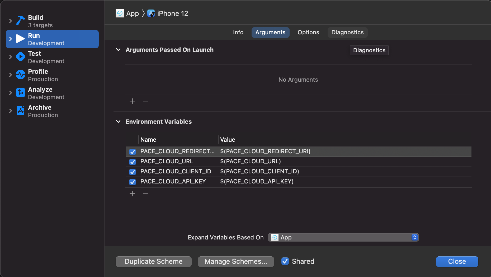

    
    <h1 align="center">Connected Fueling iOS App</h1>

Connected Fueling is an iOS project serving as an example of [PACE Cloud SDK](https://github.com/pace/cloud-sdk-ios) integration.

## Project Tooling and Requirements

These tools are required for developing the project. Please make sure to have installed the correct versions or install them for example via Homebrew 🍻

| Tool                          | Version        |
| ------------------------------|:-------------: |
| Xcode                         | 12.5.1          |
| Swift                         | 5.4.2           |
| Dependency Mangament System(s)| SwiftPM        |
| BartyCrouch                   | min 4.3.2      |
| SwiftGen                      | min 6.4.0      |
| SwiftLint                     | min 0.43.1     |
| LicensePlist                  | min 2.16.0     |

## Getting Started

Here's a few simple steps to configure this project after checking it out:

1. Open Project with Xcode wait until dependencies are fetched.
2. Navigate to Menu Product / Scheme / Edit Scheme and configure your Environment Variables.
    - PACE_CLOUD_CLIENT_ID
    - PACE_CLOUD_URL
    - PACE_CLOUD_API_KEY
    - PACE_CLOUD_REDIRECT_URI

    
3. Run the project ▶️

## Localization

The project is localized for following languages:

* English 
* German 

## Environment/Build Configurations

To use the app with different environments several build configurations are available:

- **Development:** This configuration is used in development. Server and libraries are configured for this purposes and generating dummy data is allowed. In development build phase the `LicensePlist` tool is executed to automatically build a license page for app settings. Please make sure `LicensePlist` has been installed.
- **Staging:** Is used for testing purposes. The config should be used for prerelease tests against server with a very common configuration like production machines.
- **Production:** This configuration is only used for releases, which are uploaded to the AppStore. Use it just for this except if you have no other choice. Keep in mind that you are working on a production machine and your data won't be deleted. 

### Configuration files

All environment configuration files are placed under `App\SupportingFiles\Configuration`. Each Build Configuration has its own configuration file (Development.xcconfig, Staging.xcconfig, Development.xcconfig). All properties that depends on the environment such as Base Urls should be inserted there.

### Adding a new Property to the Configration

If you want to add a new property to the configuration add it to each environment xcconfig file you find under `SupportingFiles\Configuration`.  After that you have to add it to the Info.plist as Key Value pair with the key named like you want to use it in app and value as variable with the name of the property in the xcconfig file `$(PROPERTY_NAME)`. 
For example adding a Base URL just add as key `BASE_URL` and as value of type string `$(BASE_URL)`. The variable substition is replacing the `$(BASE_URL)` entry with the value of the xcconfig file.

As example the app name is available in the configuration. It can be removed if it is not used in app.

## Frameworks

### PACECloudSDK

PACE Cloud SDK is a tool for developers to easily integrate PACE's Connected Fueling into their own apps. [PACECloudSDK on Github](https://github.com/pace/cloud-sdk-ios)

### JamitFoundation

JamitFoundation is a collection of useful concepts to enable composition oriented development with UIKit. JamitFoundation is build in MicroFramework architecture and should be dynamically setup for your needs. If you need other modules beside the base you have to readd  the framework and to choose the necessary modules. Documentation can be found here: 
[JamitFoundation on Github](https://github.com/JamitLabs/JamitFoundation)

### JLCoordinator

JLCoordinator is the base for our coordinator/presenter pattern. It will help you to use the pattern correctly. For more information visit:
[JLCoordinator on Github](https://github.com/JamitLabs/JLCoordinator)

## Generamba

[Generamba](https://github.com/strongself/Generamba) is a code generator that can generate screen flows, tests and more from pre defined templates referenced in a Rambafile.

All of our Templates are stored in a template catalog which can be found [here](https://git.jamitlabs.net/jamit-labs/iOS/generamba-template-catalog). The Rambafile is already preconfigured and usually doens't need any configuration. Of course you can add your own templates from other sources but you should use the ones from the catalog if possible. This ensures you are installing the newest version of the template.

To generate a module from a template you have to run `generamba gen MODULE_NAME TEMPLATE_NAME`.
To update the templates to their newest versions run `generamba template install`. Attention: This will delete the template folder and replace it with a new one with only the templates referenced in the Rambafile in it. Make sure to backup template adjustments or custom templates if you do this.

## License

This project is licensed under the terms of the MIT license. See the [LICENSE](/LICENSE) file.
